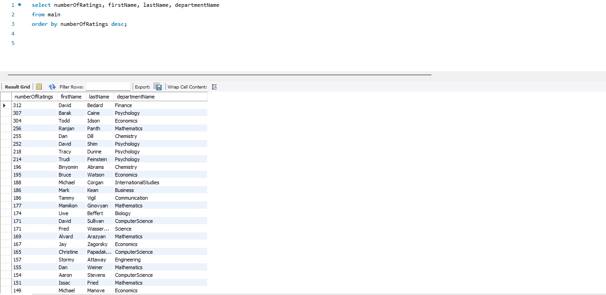

# RMPresearch
This is a personal python project that I made in my free time as I was curious about the data behind Rate My Professor, and what 
kind of relationships could be seen when the data is extracted from the website. 

## Step 1: Extracting
I first needed to find a way to extract the data from RateMyProfessor, so with a bit of research and help from user tisuela 
here on github I was able to organize a function that "organized" each professor at Boston University into a "sorted" dictionary like such.

As you can see this data isn't something that is easy to work with so with a simple for loop we can clean it up.

## Step 2: Building and Visualizing
With the data extracted and cleaned up I was able to now import the 3000+ columns of data into multiple data manipulating programs.
One of those happened to be Tableau which is one of the most powerful data visualizing programs I have ever used.

A very interesting find was that two of the highest rated departments at BU are in the Writing and Language department. Not only are they the two 
highest rated departments, but they also have of the most reviews out of any department. This information seemed to line up with the fact that 
Communication and Journalism is the third most popular major at BU.

Though Tableau is amazing at visualizing data, it doesn't always tell the full story. Knowing this I imported the data into a SQL server and using MySQL I 
was able to extract more information.

This SQL search pulled up the number of ratings from professors with the most reviews and the department they are in. Though Tableau showed us that Writing 
and the Languages department had the most reviews, why is it that the top 25 most reviewed professors are not in either of those departments? 

## Conclusion
Using more SQL searches I found that there are over 500 combined professors in each of these departments; around 230 for Writing and 280 for Languages, while
the most popular at BU, Business, has only about 100 professors. Additionally, Computer Science which sits at rank 5 for the most popular major at BU has around 140
professors. This could mean a plethora of things but a conclusion that I came to was that BU has a vast amount of courses in Writing because of how many courses
and topics BU offer in Writing specifically. To my knowledge, going through a Business or Computer Science major is quite simple and linear with not many extra curricular courses offering anything towards your graduation. It makes sense that there would be less professors for these two majors compared to Writing. As for Languages having the most unique amount of professors at BU...

